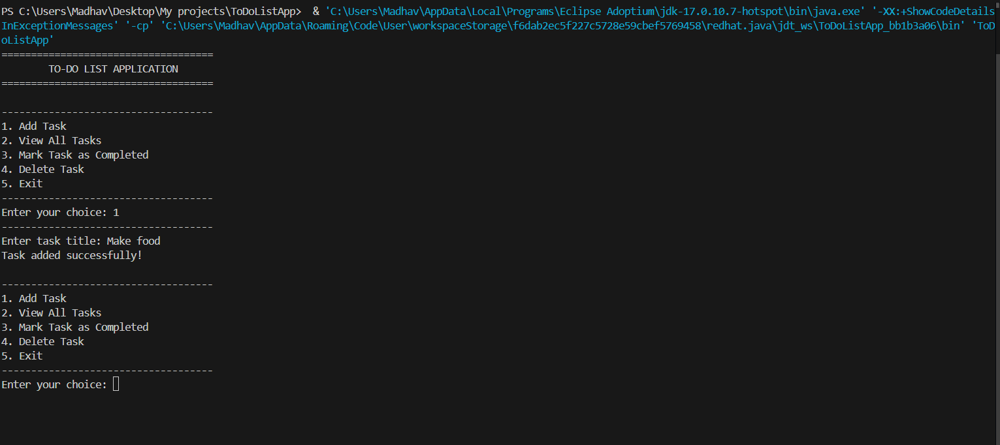

# 📝 To-Do List Application (Java Console App)

A simple and interactive **Java Console Application** built to manage daily tasks efficiently.  
This project demonstrates core **Java concepts** like loops, conditionals, classes, and `ArrayList` usage — perfect for beginners and freshers to showcase Java programming skills.

---

## ⚙️ Features

- ➕ Add new tasks  
- 📋 View all tasks  
- ✅ Mark tasks as completed  
- ❌ Delete tasks  
- 🚪 Exit the application  

---

## 🧠 Concepts Used

- **Object-Oriented Programming (OOP)**  
- **ArrayList** for dynamic task storage  
- **Switch-case** control flow  
- **Scanner** for user input  
- Clean **console-based interaction**  

---

## 🖼️ Preview

Here’s a quick look at the **To-Do List App** in action 👇  

---

## 💡 Future Improvements

- Add due dates and priority levels for each task  
- Integrate file handling for saving tasks permanently  
- Introduce color-coded task categories (Work, Study, Personal)  

---

## 👨‍💻 Author

**Madhav Agrawal**  
Frontend & Software Developer | Java | React.js | MySQL | HTML | CSS    

🔗 [LinkedIn](https://www.linkedin.com/in/madhav-agrawal-1704a0194/)  
💻 [GitHub](https://github.com/MadhavAgrawal06)

---

## 📜 License

This project is **open source** and available under the **MIT License**.  

---

⭐ *If you found this helpful, don’t forget to star the repository!*  
